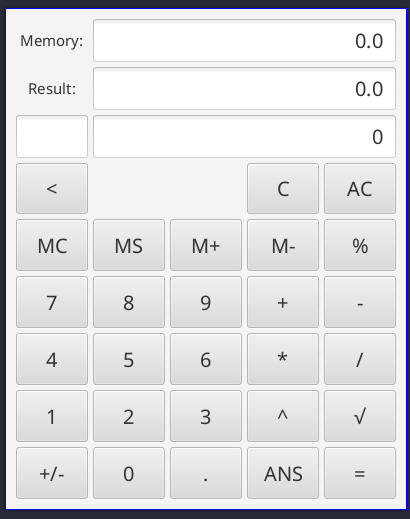

# About
Hello, my name is David and this is my first bigger project with Java and JavaFX.

# Features
* Basic operations like addition, subtraction or exponentiation.
* Memory
* Use answer from previous operation
* Float numbers
# How to use
1. First text field is the memory, second is the result and third is the current operation and current number.
1. If no operation is set then current number is also the result.
1. If you click on operation then current number becomes 0 and you can type in operand
1. Operations that doesn't require any operand are performed directly on result number.
1. For performing action you can do two things:
    * Press on equal sign or
    * Press on +, -, *, /, ^, %, then the current operation is performed and you can immediately start typing another one i.e. 6 + 6 * 9 = 108 (there is no order of operations implemented).
1. Memory
    * M+ and M- add or subtract result number to/from memory number.
    * MS sets memory number as current number.
    * MC clears the memory
